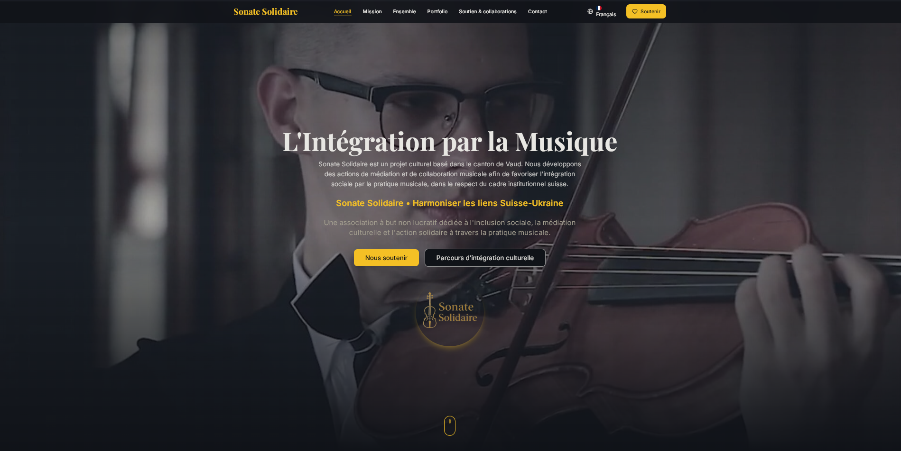
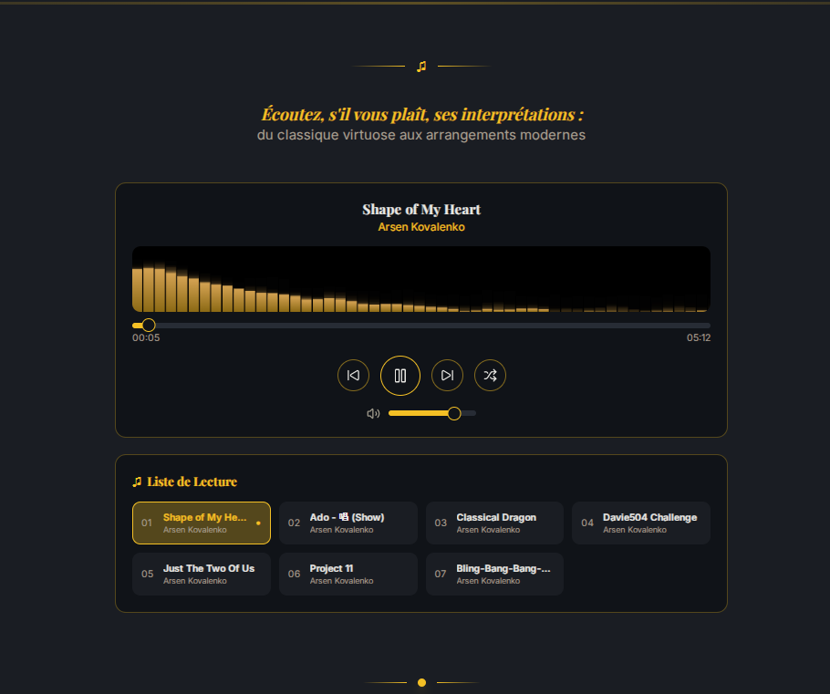
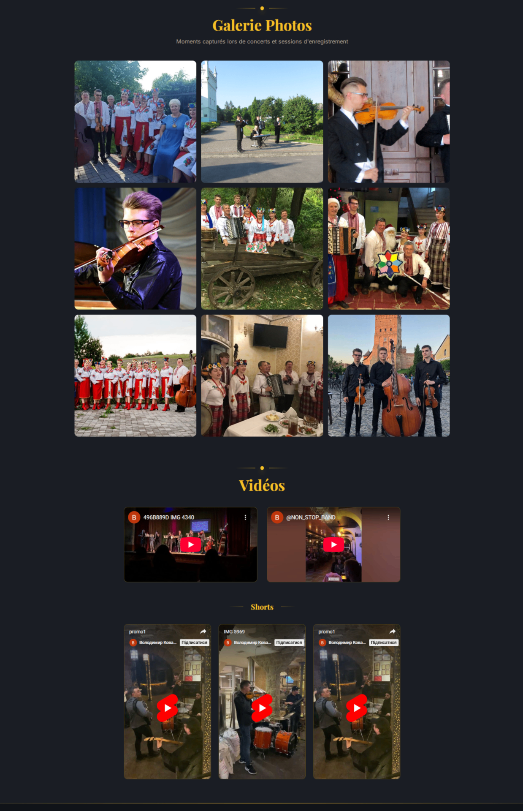
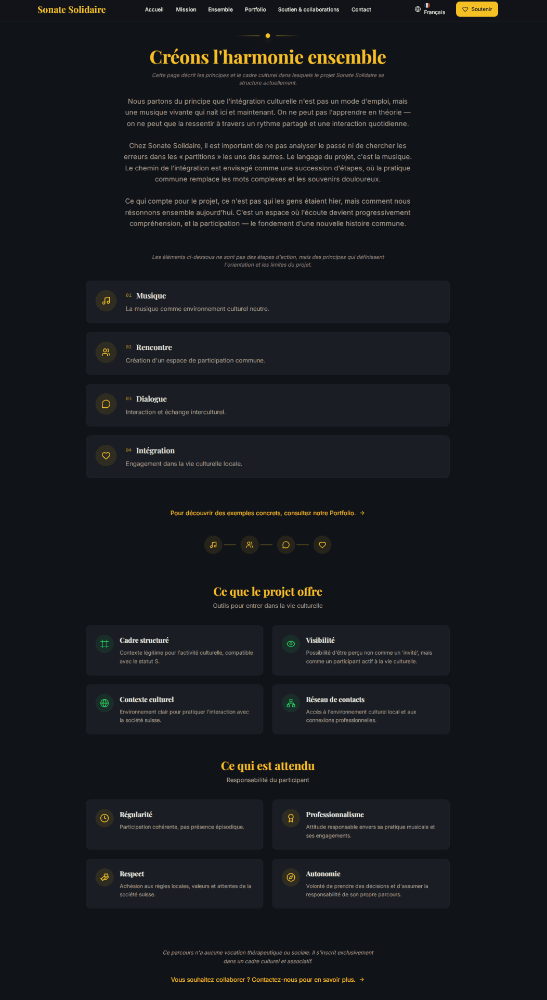
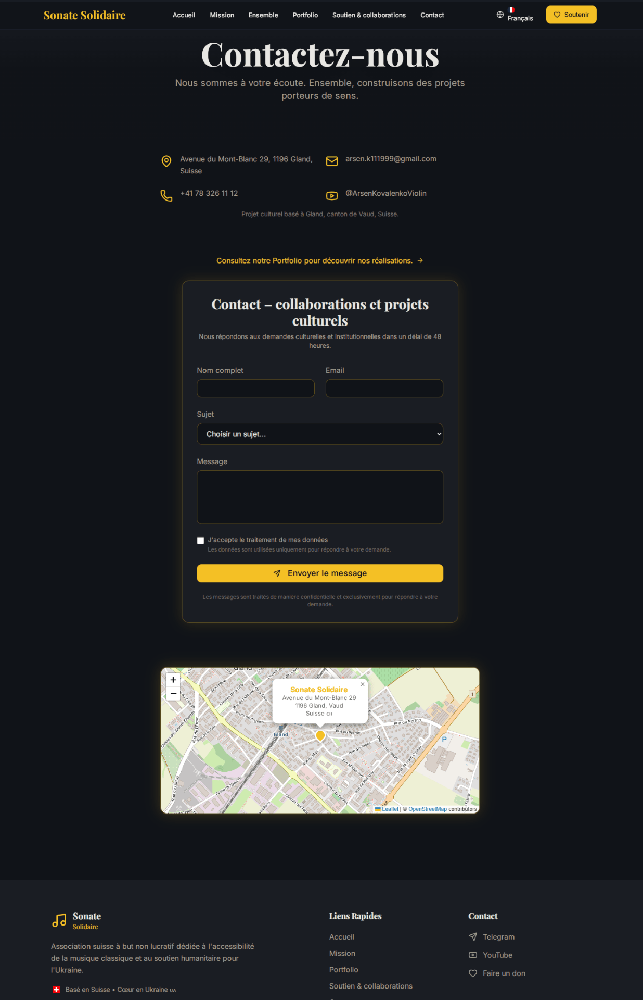
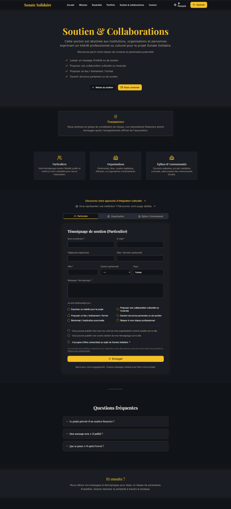
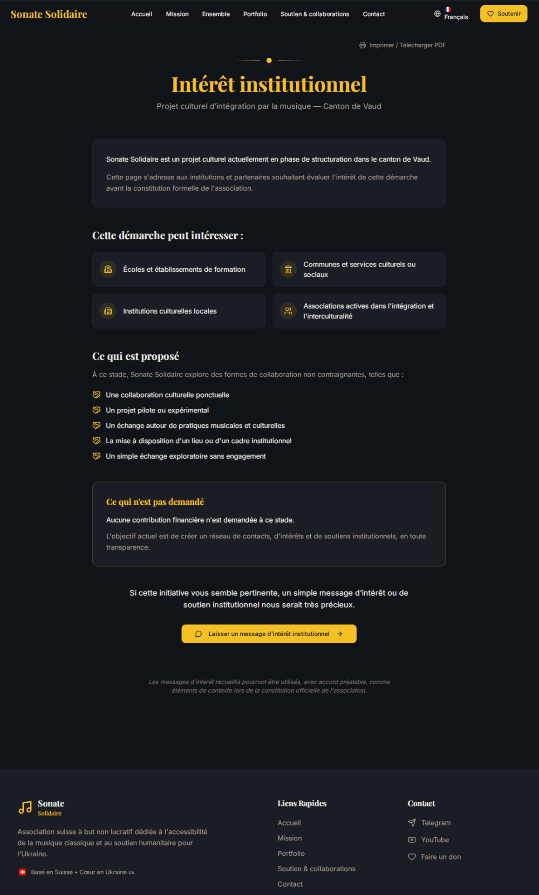

# Технічний звіт про сайт проєкту Sonate Solidaire
## Для швейцарських інституцій: шкіл, громад, культурних управлінь

**Дата підготовки:** 28 січня 2026  
**Веб-адреса:** [https://violin.pp.ua](https://violin.pp.ua)  
**Статус:** Активний, трьохмовний

---

## 1. Місія проєкту

**Sonate Solidaire** (V.I.O.L.I.N. Suisse) — це культурний проєкт соціальної інтеграції через музику, заснований у кантоні Во, Швейцарія.

### Основна ідея

Проєкт базується на переконанні, що музика є універсальною мовою, здатною долати культурні бар'єри та сприяти взаєморозумінню між спільнотами. На відміну від традиційних програм допомоги, Sonate Solidaire позиціонує музику не як терапію чи благодійність, а як **внесок у спільне культурне поле Швейцарії**.

### Ключові принципи

- **Інтеграція через внесок** — не "допомога біженцям", а участь у культурному житті
- **Взаємний обмін** — двостороння культурна комунікація
- **Довготривала перспектива** — орієнтація на стійкі партнерства з інституціями

---

## 2. Чому сайт трьохмовний?

| Мова | Причина | Аудиторія |
|------|---------|-----------|
| 🇫🇷 **Français** | Основна мова кантону Во та франкомовної Швейцарії | Школи, громади, культурні установи романдської Швейцарії |
| 🇩🇪 **Deutsch** | Охоплення німецькомовних кантонів | Розширення партнерств на всю Швейцарію |
| 🇺🇦 **Українська** | Мова засновника та української діаспори | Прозорість для української спільноти, зв'язок з походженням |

Трьохмовність забезпечує:
- Доступність для всіх основних мовних груп Швейцарії
- Прозорість для української громади
- Відповідність мультикультурній природі Швейцарії

---

## 3. Структура сайту

### 3.1 Головна сторінка (/)

**Призначення:** Перше знайомство з проєктом, загальний огляд місії та діяльності.

**Містить:**
- Hero-секція з ключовим меседжем
- Цитата-маніфест
- Коротка презентація місії
- Опис підходу та цінностей
- Інформація про команду
- Форми швидкого контакту

---

### 3.2 Портфоліо (/#portfolio)

**Призначення:** Демонстрація музичної майстерності та якості підготовки.

**Містить:**
- **Аудіозаписи** — студійні та концертні записи (класика, джаз, сучасні аранжування)
- **Фотогалерея** — професійні фото з виступів та репетицій
- **Відеоматеріали** — YouTube-інтеграція з концертними виступами та Shorts

**Цінність для інституцій:** Наочна демонстрація професійного рівня, що дозволяє оцінити якість до співпраці.

---

### 3.3 Шлях інтеграції (/integration)

**Призначення:** Детальний опис філософії та методології проєкту.

**Містить:**
- Теоретичне обґрунтування підходу
- Опис культурних меж проєкту
- Принципи співпраці з інституціями
- Відповідність швейцарським стандартам

---

### 3.4 Сторінка контакту (/contact)

**Призначення:** Пряма комунікація та бронювання виступів.

**Містить:**
- Контактна форма для загальних запитів
- Можливість бронювання виступів
- Інтерактивна карта розташування
- Прямі контактні дані

---

### 3.5 Підтримка та співпраця (/support)

**Призначення:** Збір виразів зацікавленості від потенційних партнерів.

**Важливо:** На етапі до офіційної реєстрації асоціації сторінка **не містить фандрайзингових механізмів**. Замість цього:
- Форма для вираження інтересу до співпраці
- Можливість обрати тип партнерства
- FAQ з поясненнями щодо структури проєкту

---

### 3.6 Інституційний інтерес (/interet-institutionnel)

**Призначення:** Спеціалізована точка входу для інституційних партнерів.

**Особливості:**
- Оптимізовано для друку (PDF-версія)
- QR-код для швидкого доступу
- Чіткий опис можливих форм співпраці
- Прямий CTA до форми зацікавленості

---

## 4. Особливості для швейцарської аудиторії

### ✅ Відсутність фандрайзингового тиску

- Жодних форм для пожертв чи IBAN
- Прозора комунікація про етап структурування
- Фокус на партнерстві, а не на фінансуванні

### ✅ Тон і позиціонування

- **НЕ** "допомога жертвам війни"
- **ТАК** — внесок у культурне життя Швейцарії
- Повага до швейцарської ментальності стриманості

### ✅ Правова відповідність

- Підготовка до реєстрації за швейцарським Цивільним кодексом (CCS)
- Прозорість щодо поточного статусу
- Відкритість до інституційного нагляду

### ✅ Потенціал співпраці

| Тип партнера | Можлива форма співпраці |
|--------------|-------------------------|
| Школи | Концерти, майстер-класи, культурні обміни |
| Громади | Публічні виступи, інтеграційні заходи |
| Культурні центри | Резиденції, спільні проєкти |
| Асоціації | Партнерства, мережування |

---

## 5. Прямі посилання

### Для оцінки якості
- **Портфоліо:** [violin.pp.ua/#portfolio](https://violin.pp.ua/#portfolio)
- **Аудіозаписи:** [violin.pp.ua/#portfolio](https://violin.pp.ua/#portfolio) (секція Audio)
- **Відео:** [violin.pp.ua/#portfolio](https://violin.pp.ua/#portfolio) (секція Video)

### Для ознайомлення з місією
- **Шлях інтеграції:** [violin.pp.ua/integration](https://violin.pp.ua/fr/integration)
- **Про проєкт:** [violin.pp.ua/#approach](https://violin.pp.ua/#approach)

### Для співпраці
- **Форма зацікавленості:** [violin.pp.ua/support](https://violin.pp.ua/fr/support)
- **Інституційний інтерес:** [violin.pp.ua/interet-institutionnel](https://violin.pp.ua/fr/interet-institutionnel)
- **Контакт:** [violin.pp.ua/contact](https://violin.pp.ua/fr/contact)

---

## 6. Резюме: 5 речень для зайнятої людини

> **Хто ми:** Культурний проєкт соціальної інтеграції через музику, заснований у кантоні Во.
>
> **Чим займаємось:** Організуємо концерти та культурні заходи, що сприяють міжкультурному діалогу.
>
> **Що пропонуємо:** Партнерство зі школами, громадами та культурними установами для спільних проєктів.
>
> **Як зв'язатися:** Через форму на [violin.pp.ua/contact](https://violin.pp.ua/fr/contact) або email: arsen.k111999@gmail.com
>
> **Чому варто уваги:** Професійний музичний рівень + чітка соціальна місія + готовність до інституційної співпраці без фандрайзингового тиску.

---

## Додаток: Усі скріншоти сайту

### A. Головна сторінка — Hero секція

*Перше, що бачить відвідувач — ключовий меседж проєкту та навігація.*

### B. Портфоліо — Аудіоплеєр

*Інтегрований плеєр з вибором треків різних жанрів — від класики до сучасних аранжувань.*

### C. Портфоліо — Фотогалерея та відео

*Професійні фотографії з концертів, студійних сесій та YouTube-інтеграція.*

### D. Шлях інтеграції

*Філософія та методологія культурної інтеграції через музику.*

### E. Сторінка контакту

*Інтерактивна карта, контактна форма та можливість бронювання виступів.*

### F. Підтримка та співпраця

*Форма для вираження інтересу до співпраці з вибором типу партнерства.*

### G. Інституційний інтерес

*Спеціалізована сторінка для школ, громад та культурних установ з можливістю друку.*

---

**Підготовлено:** Lovable AI  
**Для:** Проєкт Sonate Solidaire  
**Контакт:** arsen.k111999@gmail.com | +41 78 326 11 12
